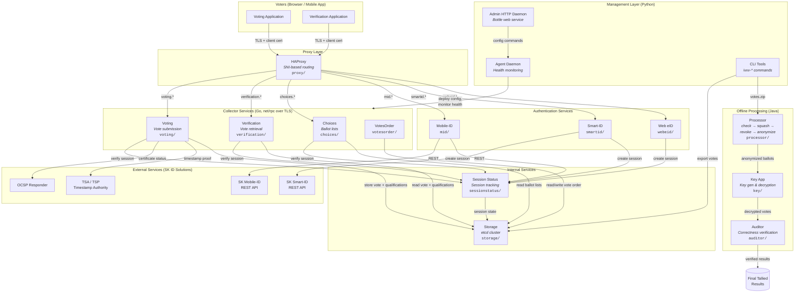
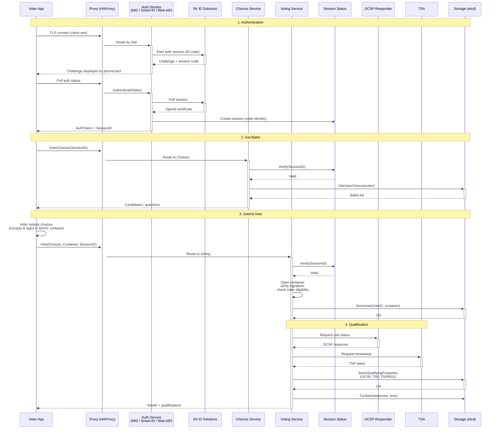
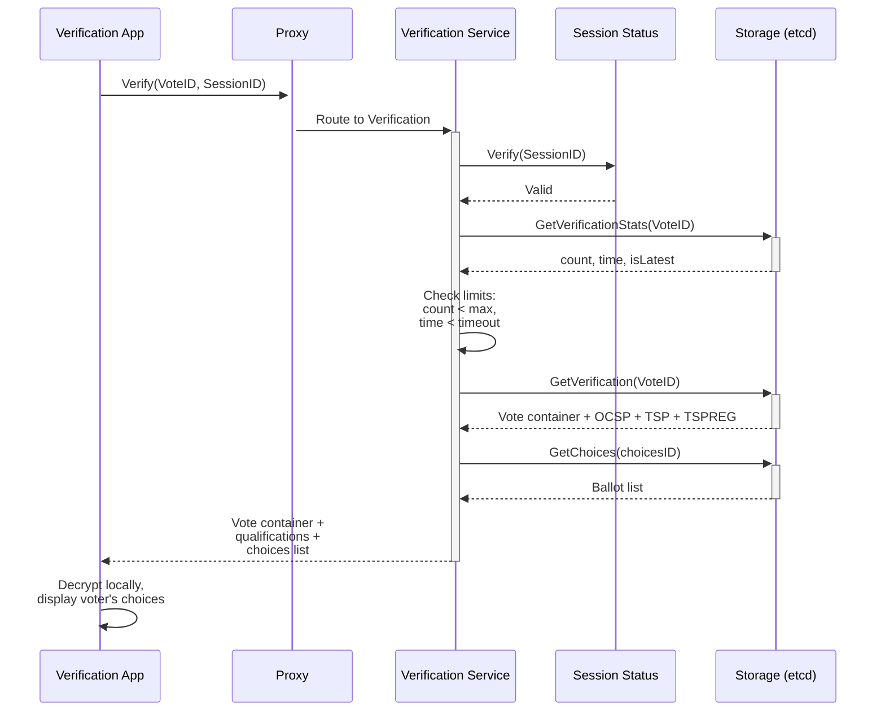
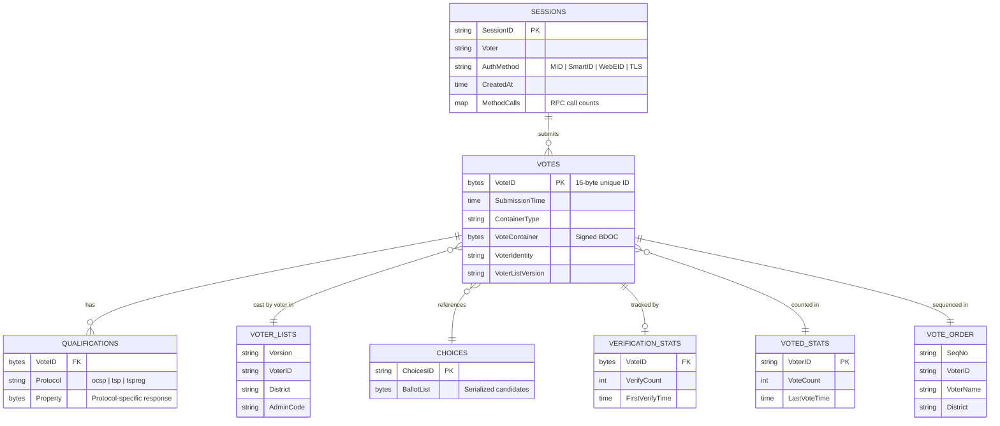

# IVXV Data Flow Diagram

## System Overview

```mermaid
graph TB
    subgraph Voters["Voters (Browser / Mobile App)"]
        VoterApp["Voting Application"]
        VerifApp["Verification Application"]
    end

    subgraph Proxy["Proxy Layer"]
        HAProxy["HAProxy<br/><i>SNI-based routing</i><br/><code>proxy/</code>"]
    end

    subgraph AuthServices["Authentication Services"]
        MID["Mobile-ID<br/><code>mid/</code>"]
        SID["Smart-ID<br/><code>smartid/</code>"]
        WEID["Web eID<br/><code>webeid/</code>"]
    end

    subgraph CollectorServices["Collector Services (Go, net/rpc over TLS)"]
        Choices["Choices<br/><i>Ballot lists</i><br/><code>choices/</code>"]
        Voting["Voting<br/><i>Vote submission</i><br/><code>voting/</code>"]
        Verif["Verification<br/><i>Vote retrieval</i><br/><code>verification/</code>"]
        VOrder["VotesOrder<br/><code>votesorder/</code>"]
    end

    subgraph InternalServices["Internal Services"]
        SessStatus["Session Status<br/><i>Session tracking</i><br/><code>sessionstatus/</code>"]
        Storage["Storage<br/><i>etcd cluster</i><br/><code>storage/</code>"]
    end

    subgraph ExternalAPIs["External Services (SK ID Solutions)"]
        SKMID["SK Mobile-ID<br/>REST API"]
        SKSID["SK Smart-ID<br/>REST API"]
        OCSP["OCSP Responder"]
        TSA["TSA / TSP<br/>Timestamp Authority"]
    end

    subgraph Admin["Management Layer (Python)"]
        AdminHTTP["Admin HTTP Daemon<br/><i>Bottle web service</i>"]
        AgentD["Agent Daemon<br/><i>Health monitoring</i>"]
        CLI["CLI Tools<br/><i>ivxv-* commands</i>"]
    end

    subgraph Offline["Offline Processing (Java)"]
        KeyApp["Key App<br/><i>Key gen & decryption</i><br/><code>key/</code>"]
        Processor["Processor<br/><i>check → squash →<br/>revoke → anonymize</i><br/><code>processor/</code>"]
        Auditor["Auditor<br/><i>Correctness verification</i><br/><code>auditor/</code>"]
    end

    Results[("Final Tallied<br/>Results")]

    %% Voter → Proxy
    VoterApp -->|"TLS + client cert"| HAProxy
    VerifApp -->|"TLS + client cert"| HAProxy

    %% Proxy → Services
    HAProxy -->|"voting.*"| Voting
    HAProxy -->|"verification.*"| Verif
    HAProxy -->|"choices.*"| Choices
    HAProxy -->|"mid.*"| MID
    HAProxy -->|"smartid.*"| SID
    HAProxy -->|"webeid.*"| WEID

    %% Auth → External
    MID -->|"REST"| SKMID
    SID -->|"REST"| SKSID

    %% Auth → Session
    MID -->|"create session"| SessStatus
    SID -->|"create session"| SessStatus
    WEID -->|"create session"| SessStatus

    %% Collector → SessionStatus
    Voting -->|"verify session"| SessStatus
    Verif -->|"verify session"| SessStatus
    Choices -->|"verify session"| SessStatus

    %% Voting → external qualification
    Voting -->|"certificate status"| OCSP
    Voting -->|"timestamp proof"| TSA

    %% Collector → Storage
    Voting -->|"store vote + qualifications"| Storage
    Verif -->|"read vote + qualifications"| Storage
    Choices -->|"read ballot lists"| Storage
    VOrder -->|"read/write vote order"| Storage
    SessStatus -->|"session state"| Storage

    %% Admin → Services
    AdminHTTP -->|"config commands"| AgentD
    AgentD -->|"deploy config,<br/>monitor health"| CollectorServices
    CLI -->|"export votes"| Storage

    %% Offline processing
    CLI -->|"votes.zip"| Processor
    Processor -->|"anonymized ballots"| KeyApp
    KeyApp -->|"decrypted votes"| Auditor
    Auditor -->|"verified results"| Results
```

## Vote Submission Flow

```mermaid
sequenceDiagram
    participant V as Voter App
    participant P as Proxy (HAProxy)
    participant A as Auth Service<br/>(MID / Smart-ID / Web eID)
    participant SK as SK ID Solutions
    participant Ch as Choices Service
    participant Vo as Voting Service
    participant SS as Session Status
    participant OCSP as OCSP Responder
    participant TSA as TSA
    participant St as Storage (etcd)

    Note over V,St: 1. Authentication
    V->>+P: TLS connect (client cert)
    P->>+A: Route by SNI
    A->>+SK: Start auth session (ID code)
    SK-->>-A: Challenge + session code
    A-->>-V: Challenge displayed on phone/card
    V->>+P: Poll auth status
    P->>+A: AuthenticateStatus
    A->>+SK: Poll session
    SK-->>-A: Signed certificate
    A->>SS: Create session (voter identity)
    A-->>-V: AuthToken + SessionID

    Note over V,St: 2. Get Ballot
    V->>+P: VoterChoices(SessionID)
    P->>+Ch: Route to Choices
    Ch->>SS: Verify(SessionID)
    SS-->>Ch: Valid
    Ch->>+St: GetVoterChoices(voter)
    St-->>-Ch: Ballot list
    Ch-->>-V: Candidates / questions

    Note over V,St: 3. Submit Vote
    V->>V: Voter selects choices,<br/>encrypts & signs in BDOC container
    V->>+P: Vote(Choices, Container, SessionID)
    P->>+Vo: Route to Voting
    Vo->>SS: Verify(SessionID)
    SS-->>Vo: Valid
    Vo->>Vo: Open container,<br/>verify signature,<br/>check voter eligibility
    Vo->>+St: StoreVote(VoteID, container)
    St-->>-Vo: OK

    Note over Vo,TSA: 4. Qualification
    Vo->>+OCSP: Request cert status
    OCSP-->>-Vo: OCSP response
    Vo->>+TSA: Request timestamp
    TSA-->>-Vo: TSP token
    Vo->>+St: StoreQualifyingProperties<br/>(OCSP, TSP, TSPREG)
    St-->>-Vo: OK
    Vo->>St: TxnSetVoted(voter, time)
    Vo-->>-V: VoteID + qualifications
```

## Vote Verification Flow

```mermaid
sequenceDiagram
    participant V as Verification App
    participant P as Proxy
    participant Ve as Verification Service
    participant SS as Session Status
    participant St as Storage (etcd)

    V->>+P: Verify(VoteID, SessionID)
    P->>+Ve: Route to Verification
    Ve->>SS: Verify(SessionID)
    SS-->>Ve: Valid

    Ve->>+St: GetVerificationStats(VoteID)
    St-->>-Ve: count, time, isLatest

    Ve->>Ve: Check limits:<br/>count < max,<br/>time < timeout

    Ve->>+St: GetVerification(VoteID)
    St-->>-Ve: Vote container + OCSP + TSP + TSPREG

    Ve->>+St: GetChoices(choicesID)
    St-->>-Ve: Ballot list

    Ve-->>-V: Vote container +<br/>qualifications +<br/>choices list

    V->>V: Decrypt locally,<br/>display voter's choices
```

## Offline Processing Pipeline

```mermaid
flowchart LR
    subgraph Online["Online Phase"]
        St[("Storage<br/>(etcd)")]
    end

    subgraph Export["Export"]
        Exp["ivxv-export-votes"]
    end

    subgraph Processing["Offline Processing (Java)"]
        Check["Check<br/><i>Validate signatures</i>"]
        Squash["Squash<br/><i>Keep latest vote<br/>per voter</i>"]
        Revoke["Revoke<br/><i>Remove invalid<br/>votes</i>"]
        Anon["Anonymize<br/><i>Strip voter<br/>identity</i>"]
    end

    subgraph Decrypt["Decryption"]
        Key["Key App<br/><i>Threshold decryption</i>"]
    end

    subgraph Audit["Audit & Tally"]
        Aud["Auditor<br/><i>Verify correctness</i>"]
        Tally["Final<br/>Results"]
    end

    St -->|"votes.zip<br/>(encrypted containers<br/>+ qualifications)"| Exp
    Exp --> Check
    Check -->|"valid votes"| Squash
    Squash -->|"deduplicated"| Revoke
    Revoke -->|"final set"| Anon
    Anon -->|"anonymous<br/>ballots"| Key
    Key -->|"plaintext<br/>votes"| Aud
    Aud -->|"verified"| Tally
```

## Storage Data Model

```mermaid
erDiagram
    VOTES {
        bytes VoteID PK "16-byte unique ID"
        time SubmissionTime
        string ContainerType
        bytes VoteContainer "Signed BDOC"
        string VoterIdentity
        string VoterListVersion
    }
    QUALIFICATIONS {
        bytes VoteID FK
        string Protocol "ocsp | tsp | tspreg"
        bytes Property "Protocol-specific response"
    }
    VOTER_LISTS {
        string Version
        string VoterID
        string District
        string AdminCode
    }
    CHOICES {
        string ChoicesID PK
        bytes BallotList "Serialized candidates"
    }
    SESSIONS {
        string SessionID PK
        string Voter
        string AuthMethod "MID | SmartID | WebEID | TLS"
        time CreatedAt
        map MethodCalls "RPC call counts"
    }
    VOTED_STATS {
        string VoterID PK
        int VoteCount
        time LastVoteTime
    }
    VERIFICATION_STATS {
        bytes VoteID FK
        int VerifyCount
        time FirstVerifyTime
    }
    VOTE_ORDER {
        string SeqNo
        string VoterID
        string VoterName
        string District
    }

    VOTES ||--o{ QUALIFICATIONS : "has"
    VOTES }o--|| VOTER_LISTS : "cast by voter in"
    VOTES }o--|| CHOICES : "references"
    VOTES ||--o| VERIFICATION_STATS : "tracked by"
    VOTES }o--|| VOTED_STATS : "counted in"
    VOTES ||--|| VOTE_ORDER : "sequenced in"
    SESSIONS ||--o{ VOTES : "submits"
```
